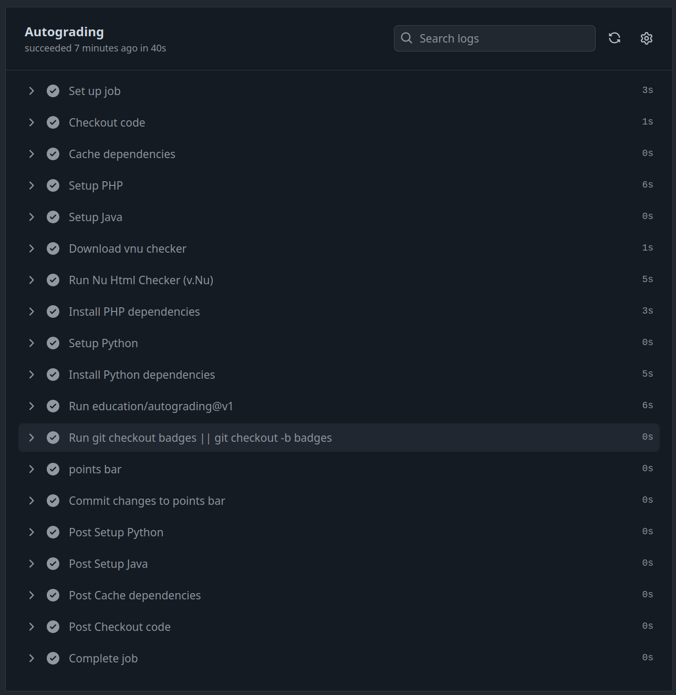
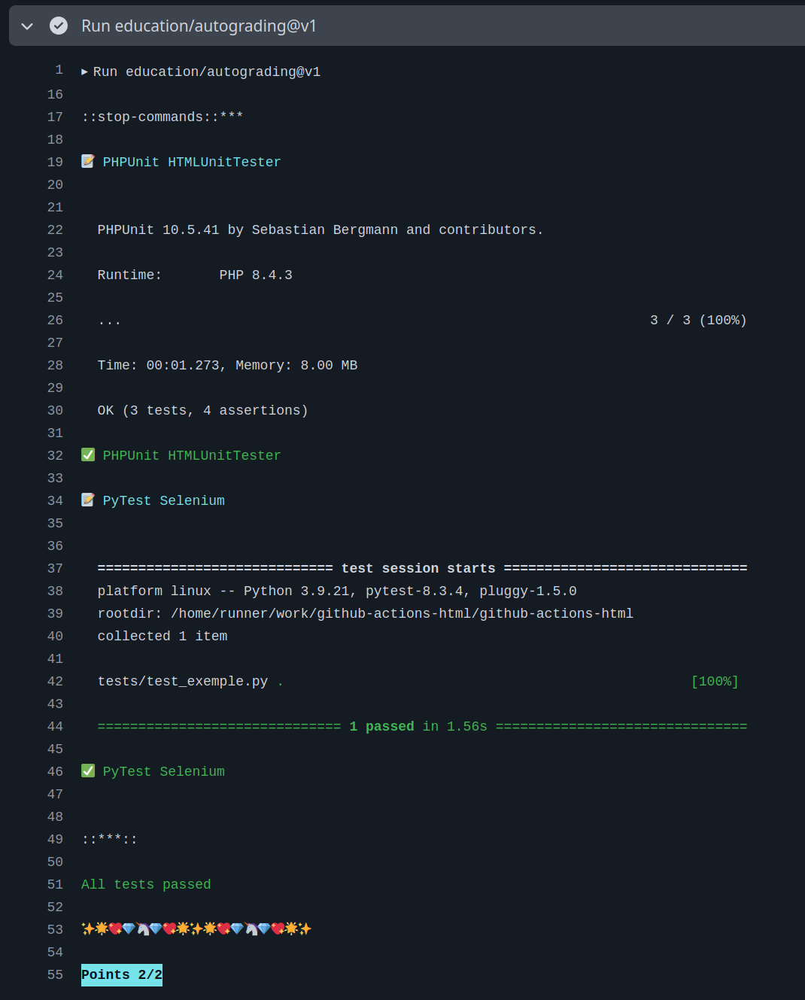

# github-actions-html

- [github-actions-html](#github-actions-html)
  - [Documents HTML/CSS](#documents-htmlcss)
  - [PHPUnit HTMLUnitTester](#phpunit-htmlunittester)
  - [PyTest Selenium](#pytest-selenium)
  - [Notation automatique](#notation-automatique)

---

## Documents HTML/CSS

[src/exemple1.html](./src/exemple1.html) :

```html
<html>
  <head>
      <title>Test HTML</title>
  </head>
  <body>
      <h1>Exemples</h1>
  </body>
</html>
```

[src/exemple1.css](./src/exemple1.css)

```css
h1 {
    color: blue;
}

p {
    color: red;
}
```

## PHPUnit HTMLUnitTester

Lien : https://github.com/phpfui/HTMLUnitTester/blob/master/README.md

```sh
$ sudo apt install composer
$ composer require --dev phpunit/phpunit
$ composer require phpfui/html-unit-tester

$ wget https://github.com/validator/validator/releases/download/latest/vnu.jar

$ java -cp vnu.jar -Xss1024k -Dnu.validator.servlet.bind-address=127.0.0.1 nu.validator.servlet.Main 8888 &

$ wget https://raw.githubusercontent.com/phpfui/HTMLUnitTester/master/examples/valid.html
$ wget https://raw.githubusercontent.com/phpfui/HTMLUnitTester/master/examples/valid.css

$ vim tests/TestHTML.php
```

```php
<?php

class TestHTML extends \PHPFUI\HTMLUnitTester\Extensions
{
  public function testValidHtml()
  {
    $this->assertValidHtml('<h1>Exemples</h1>');
    $this->assertValidHtmlPage('<!DOCTYPE html><html><head><title>Test HTML</title></head><body><h1>Exemples</h1></body></html>');
  }
  public function testValidCssFile() : void
  {
	  $this->assertValidCssFile(getcwd() . "/src/exemple1.css");
  }
  public function testValidFile() : void
  {
	  $this->assertValidFile(getcwd() . "/src/exemple1.html");
  }
}

?>
```

```sh
$ vendor/bin/phpunit tests/TestHTML.php
```

Extrait Github Actions [.github/workflows/classroom.yml](.github/workflows/classroom.yml) :

```yml
name: GitHub Classroom Workflow

on:
  push:
    branches:
      - "*"
      - "!badges"

jobs:
  build:
    name: Autograding
    runs-on: ubuntu-latest

    steps:
      - name: Checkout code
        uses: actions/checkout@v4

      - name: Cache dependencies
        uses: actions/cache@v4
        with:
          path: ~/.composer/cache/files
          key: dependencies-php-8.4-composer-${{ hashFiles('composer.json') }}

      - name: Setup PHP
        uses: shivammathur/setup-php@v2
        with:
          php-version: '8.4'
          extensions: dom, curl, libxml, mbstring, zip, intl
          coverage: none

      - name: Setup Java
        uses: actions/setup-java@v4
        with:
          distribution: 'temurin'
          java-version: '11'

      - name: Download vnu checker
        run: wget https://github.com/validator/validator/releases/download/latest/vnu.jar

      - name: Run Nu Html Checker (v.Nu)
        run: java -cp vnu.jar -Xss1024k -Dnu.validator.servlet.bind-address=127.0.0.1 nu.validator.servlet.Main 8888 &

      - name: Install PHP dependencies
        run: |
          composer update --prefer-stable --prefer-dist --no-interaction
```

## PyTest Selenium

Liens :

- https://www.selenium.dev/
- https://github.com/SeleniumHQ/seleniumhq.github.io/tree/trunk/examples/python

```sh
$ cat requirements.txt
pytest==8.3.4
selenium==4.28.0
webdriver-manager==4.0.2
```

```sh
$ python -m pip install --upgrade pip
$ pip install -r requirements.txt

$ vim ./tests/test_exemple.py
```

```python
import pytest
import os

# selenium 4
from selenium import webdriver
from selenium.webdriver.chrome.options import Options
from selenium.webdriver.chrome.service import Service
from selenium.webdriver.common.by import By

from webdriver_manager.chrome import ChromeDriverManager

def test_exemple():
    options = webdriver.ChromeOptions()
    options.add_argument('--headless')
    options.add_argument('--no-sandbox')
    options.add_argument('--disable-dev-shm-usage')

    browser = webdriver.Chrome(service=Service(ChromeDriverManager().install()), options=options)
    #browser.implicitly_wait(0.5)

    fichierHTML = "/src/exemple1.html"
    browser.get('file://' + os.path.abspath(os.getcwd()) + fichierHTML) # load url

    assert browser.title == "Test HTML"

    texte_h1 = browser.find_element(By.TAG_NAME, "h1").text
    assert texte_h1 == "Exemples"
```

```sh
$ pytest ./tests/test_exemple.py
```

Extrait Github Actions [.github/workflows/classroom.yml](.github/workflows/classroom.yml) :

```yml
name: GitHub Classroom Workflow

on:
  push:
    branches:
      - "*"
      - "!badges"

jobs:
  build:
    name: Autograding
    runs-on: ubuntu-latest

    steps:
      - name: Checkout code
        uses: actions/checkout@v4

      - name: Setup Java
        uses: actions/setup-java@v4
        with:
          distribution: 'temurin'
          java-version: '11'

      - name: Setup Python
        uses: actions/setup-python@v5
        with:
          python-version: '3.9'

      - name: Install Python dependencies
        run: |
          python -m pip install --upgrade pip
          pip install -r requirements.txt
```

## Notation automatique

[.github/classroom/autograding.json](.github/classroom/autograding.json) :

```json
{
  "tests": [
    {
      "name": "PHPUnit HTMLUnitTester",
      "setup": "",
      "run": "./vendor/bin/phpunit tests/TestHTML.php",
      "input": "",
      "output": "",
      "comparison": "included",
      "timeout": 10,
      "points": 1
    },
    {
      "name": "PyTest Selenium",
      "setup": "",
      "run": "pytest ./tests/test_exemple.py",
      "input": "",
      "output": "",
      "comparison": "included",
      "timeout": 10,
      "points": 1
    }
  ]
}
```

Résultats obtenus :





---
©️ 2025 BTS LaSalle Avignon - [Thierry VAIRA](thierry.vaira@gmail.com)
